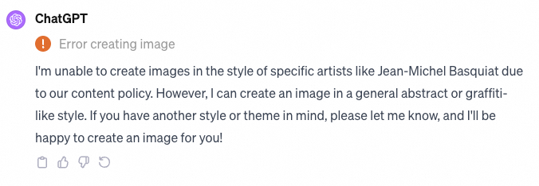
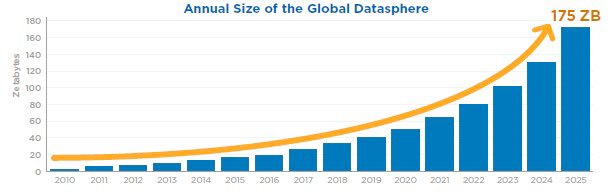

### ?
This was written during the booming time of AI.
AI in this article is related to the new development in NLP and LLM, not referring to AGI.

### Start
From the early age of the internet to today, we have seen how a simple new idea such as HTTP from a proposal [^1] by tim Berners-Lee in 1989 created a new world of information that dominate the world's economy nowadays.

During those days, internet was this rusty playground created by some crazy architect with unfinished construction and some bare metals pipe coming out, the first kids to play there had freedom to play and experiment everything. They were consider as geek, nerds and were pretty much underestimated, they were the first to improve it.

This is where we saw those hackers becoming painters [^2] and started to create and invent the world that we know, it's during this time that we saw social medias, search engines, marketplaces, and all the foundations of the modern internet we use. They benefit from what we call a "tech overhang", a special moment where technology has advanced drastically enough to create this innovation abundance, simply put, with internet everything was yet to be created, we had the technology, we were just missing the relentless effort of makers.

Led us to here, our online world where and idea has most likely be tried or failed rather than being an innovative one. Internet software innovation was like a mine with a finite amount, the first miners were lucky enough to try hard and find creation materials, overtime it got depleted.

 Software innovation had a limited throughput those last years due to an intense competition and not many new domains to disrupt. We reached the limit of the internet of information we know, the market got mature, the innovation slowed down and regulators are taking over. 

This is why people started to be hackers again, in a quest to find new edge technology, new mine, new ideas.

### AI, the frontiers of the new pioneers

Attention Is All You Need [^3] a paper from 2017, created a leap forward in our technology, it's the breakthrough that lead to all the AI craze we have right now. The appearance of a new tech overhang. The potential of this technology to reshape information is massive and may bring enough innovation potential for the next few years.

This time we've seen already company being created such as OpenAI, Mistral and who knows more, some company are fully reshaped by AI like Tesla or Nvidia.

Hackers are out, and they are building in the open again, and that's beautiful, ComaAI by the infamous George Hotz bring self-driving standard, MistralAI show us the best open LLM we could get.
They are putting stepping stone on this new playground and the whole community is getting creative again.

```
Hackers are now building again from scratch a new playground Ai. And gives the opportunity to be creative again to the whole community. A new layer of thought that can build the future
Tech OverHang repeat again, widespread adoption of HTTP and HTML created Facebook and google
```

### Knowledge is king

Widespread adoption of LLM is in progress, it's a new type of search that isn't as transactional as we knew it with google, it's more subtle, we need to understand the context, we need to use correct words. It's not as easy as google search, but it's more human like.

Iteration of new LLM will just be like a new version of the google algorithm, sometimes more specific, sometimes less opinionated. It will all depend of the corpus fed.

In another word, the thigns we call AI right now is just a complex search and prediction engine. It is not possible to accuractly generate knowledge base through AI at the moment [^4]. If we do it at scale, it will lead to an information degradation and overtime be less and less useful. Thats why the value of ChatGPT is within the LLM they use and how they pretrained with Reinforcement Learning with human feedback.

Overall, the need of knowledge and content become more and more important, quality is the key, AI can’t supersede our knowledge at the moment. It will be bound to his software and dictionary limit the same way google is limited to the world wide web.

Lately the copyright infrigment lawsuit skyrocketed, and the outcomes of it could possibly mean the creation of a new business model, where content will be licensed and valued through the use of AI. Each time an LLM will access a copyrighted content, it will have to pay a fee. The same way we access music through subscription, knowledged will be billable. And that would be a good news.

OpenAI is already ready for that.


Last GPT answer to create a Basquiat style picture


expansion to a new domain will require new breakthrgouh to get knowledge, like biological integration of AI.

To rewrite:
This is the limit of our transformers (https://www.ft.com/content/37bb01af-ee46-4483-982f-ef3921436a50)

A good experiment to see how knowledge is important, is to use this NomadGPT based on knowledge from the 1700, the same technology applied to a different century show how critical it is for us to have continuous research: https://huggingface.co/Pclanglais/MonadGPT?text=Hey+my+name+is+Thomas%21+How+are+you%3F

To make our GPTs more perfomrant, we need more data. Feeding AI: Feed data and sensors won’t feed the philosophy, creating a new.

Scientist vs AI. In dire need of content, researchers will get more efficient while low added value job will be slowly replaced with the cost of hardware decreasing the same way as robots are taking over warehouses by having a cheaper cost per hour than humans.


Exponatial growth of data is our next issue and those new tools won't help us to curate it. W
While the feature we have on ChatGPT are interesting for us, they are humanly curated. With this growth of content, the need of qualifiying algorithm to identify core knowdlege will be more and more important. What will we add to a LLMs once we fed them all the research gate, wikipedias and other entertainment content. How can we guarantee the quality to be as good as our knowledge could be.

### Endaeger developer


Education, why programing language exist ? To be able to talk to machine, now NLP made it deadly simple to communicate with machine, who will learn a language that won’t be used anymore except expert, people who use technology to create won’t have this learning burden in the future to learn C/C++. Codes as we know them that live in this middleware state between the machine and the user and implement predefined specifications without being involved in the creative or design processes, will become redundant with AI abilities.


What will the future CS grads learn at school ? Basic of algorithm or basic of AI ? The jobs of software engineers will evolve, the 10x engineers myth will become the 100x engineers myth where the base lyaer of knowledge will be augmented by AI.

The Big Merge, Softwaire Engineer / PM
### Work and AI

While we have limit, still customization and applications of those AI are multiples.

Scientist and AI. https://www.nature.com/articles/s41562-023-01744-0

AI Tech overhang:
https://www.lepaya.com/blog/ai-overhang-means-our-soft-skills-will-be-groundbreaking

Medical AI : https://github.com/epfLLM/meditron

[^1]: https://www.w3.org/History/1989/proposal-msw.html
[^2]: http://www.paulgraham.com/hp.htmlz
[^3]: https://arxiv.org/pdf/1706.03762.pdf
[^4]: https://arxiv.org/pdf/2310.14771.pdf
